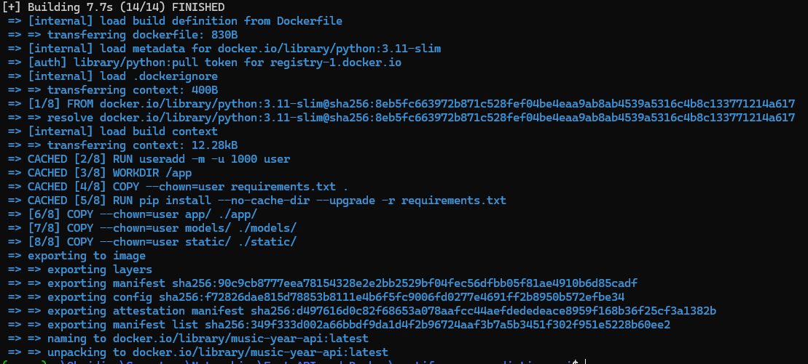

# Music Release Year Prediction API

Predicts the release year of songs (1921-2020) based on Spotify audio features.

## Task 1: Model Training

1. Dataset: Spotify Dataset 1921-2020 (170k+ tracks)
2. Model: Random Forest Regressor (100 estimators, max_depth=15)
3. Training time: ~10 seconds on Ryzen 7 Pro (16 cores)
4. Model saved: `models/music_year_model.pkl` (144 MB)

### Dataset

**Training Data:** [Spotify Dataset 1921-2020, 160k+ Tracks](https://www.kaggle.com/datasets/yamaerenay/spotify-dataset-1921-2020-160k-tracks) from Kaggle (170,653 songs)

The dataset contains audio features for songs spanning 100 years of music history. The pre-trained model is included in `models/` directory, so **you don't need to download the training data** to run the API.

**Note:** Training data is excluded from this repository due to size (20+ MB). If you want to retrain the model, download from the Kaggle link above and extract the zip into the ./data/ directory.

### Features Used

The model uses 12 audio features:
- **Acousticness** (47% importance) - Most predictive feature
- **Loudness** (15% importance)
- **Speechiness** (10% importance)
- Danceability, energy, instrumentalness, liveness, valence
- Duration, key, mode, tempo

### Model Performance

- **R² Score:** 0.6804 (68% variance explained)
- **Mean Absolute Error:** 10.72 years
- **RMSE:** 14.69 years
- **Training Samples:** 136,522
- **Test Samples:** 34,131

## Task 2: FastAPI Implementation

### Endpoints

- `GET /health`: Health/status JSON, model loaded flag, and available endpoints
  
- `POST /predict`: Predict release year from 12 audio features (JSON body)
  
- `GET /`: Interactive UI
  
- `GET /docs`: Swagger UI
  
- `GET /redoc`: ReDoc
  

### Test Results
- **1970s Rock:** Predicted 1979 (actual 1970) - Error: 9 years
- **1920s Classical:** Predicted 1935 (actual 1921) - Error: 14 years
- **2020 Pop:** Predicted 2011 (actual 2020) - Error: 9 years
- **Invalid Input:** Properly rejected with 422 validation error

## Task 4: Docker Containerization

1. **Image:** music-year-api (886 MB)
2. **Container:** Runs identically to local version
3. **Tests:** All passing (health check, predictions, validation)
4. **Commands:**
   - Build: `docker build -t music-year-api .`
   - Run: `docker run -d -p 8000:8000 --name music-year-api music-year-api`
   - Test: Same results as local (1979 prediction for 1970 song)

## Setup Instructions

### 1. Extract Model Files

The repository contains `models/model.zip`, extract it before running

This should produce:

- `models/music_year_model.pkl` (~144 MB)
- `models/feature_names.pkl`


### 2. Run Locally

```bash
python -m uvicorn app.main:app --reload --port 8000
```


### 3. Run with Docker

```bash
docker build -t music-year-api .
docker run -d -p 8000:8000 --name music-year-api music-year-api
docker ps
```




## Example Requests and Responses

### Successful prediction (HTTP 200)

Request body:

```json
{
  "acousticness": 0.0936,
  "danceability": 0.743,
  "energy": 0.47,
  "instrumentalness": 0.0000315,
  "liveness": 0.186,
  "loudness": -13.154,
  "speechiness": 0.029,
  "tempo": 116.122,
  "valence": 0.89,
  "duration_ms": 160333.0,
  "key": 0.0,
  "mode": 1.0
}
```

Response body:

```json
{
  "predicted_year": 1979,
  "confidence_interval": { "lower": 1964, "upper": 1993 },
  "model_info": { "r2_score": 0.6804, "mae": 10.72, "rmse": 14.69 }
}
```

### Validation error (HTTP 422)

Request body:

```json
{
  "acousticness": 0.5,
  "danceability": 0.7
}
```

Response body (example):

```json
{
  "detail": [
    { "type": "missing", "loc": ["body", "energy"], "msg": "Field required" },
    { "type": "missing", "loc": ["body", "instrumentalness"], "msg": "Field required" }
  ]
}
```

## cURL Examples

```bash
# Health
curl -s http://localhost:8000/health | jq

# Predict
curl -s -X POST http://localhost:8000/predict \
  -H "Content-Type: application/json" \
  -d '{
    "acousticness": 0.0936,
    "danceability": 0.743,
    "energy": 0.47,
    "instrumentalness": 0.0000315,
    "liveness": 0.186,
    "loudness": -13.154,
    "speechiness": 0.029,
    "tempo": 116.122,
    "valence": 0.89,
    "duration_ms": 160333.0,
    "key": 0.0,
    "mode": 1.0
  }' | jq
```
